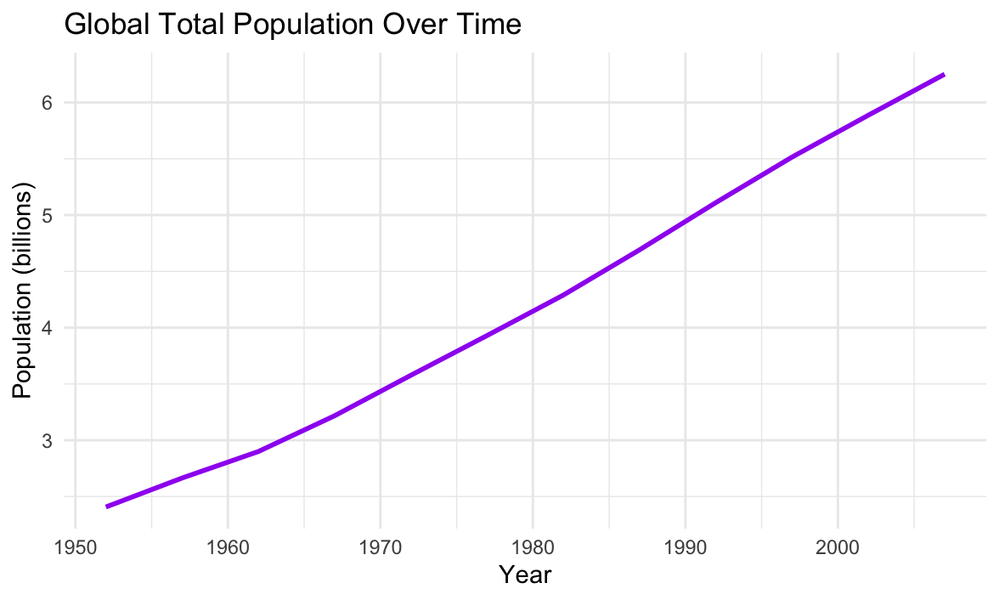
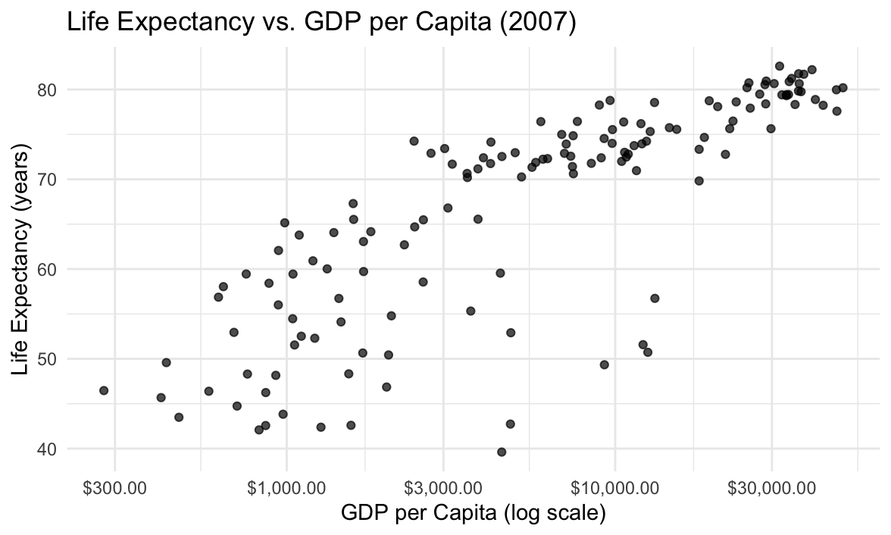
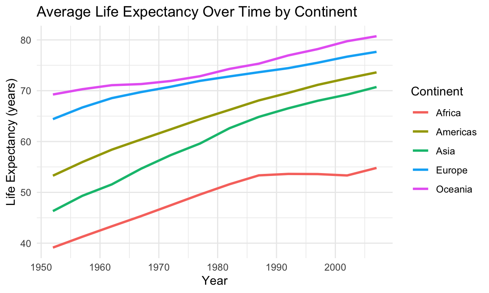
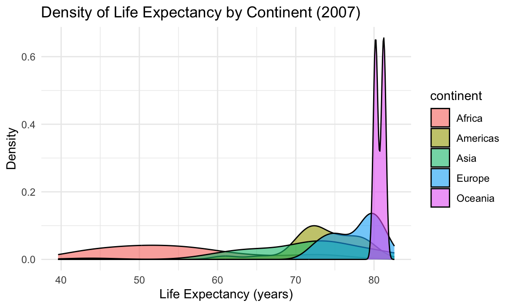
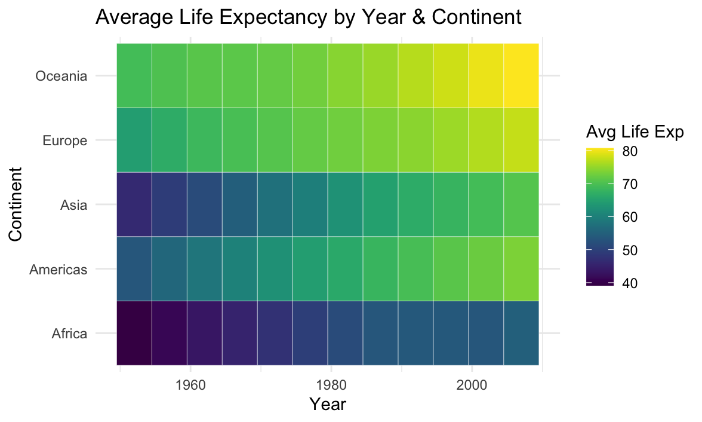

# Gapminder Data Analysis

A comprehensive R-based project that analyzes the Gapminder dataset (1952–2007) to explore global trends in life expectancy, GDP per capita, and population. The analysis produces a suite of 12 visualizations, fits a regression model, and renders an HTML report.

## Table of Contents

1. [Project Overview](#project-overview)  
2. [Features & Charts](#features--charts)  
3. [Prerequisites](#prerequisites)  
4. [Installation](#installation)  
5. [Usage](#usage)  
6. [File Structure](#file-structure)  
7. [Scripts & Automation](#scripts--automation)  
8. [Docker & Containerization](#docker--containerization)  
9. [Extending & Customizing](#extending--customizing)  
10. [Data Source & Citations](#data-source--citations)  
11. [License](#license)  

---

## Project Overview

This repository contains everything needed to:

- **Fetch** and prepare the Gapminder dataset via the `gapminder` R package.  
- **Compute** key metrics (global averages, per-country snapshots).  
- **Visualize** 12 charts illustrating temporal trends, economic relationships, continental comparisons, and population impacts.  
- **Model** the relationship between life expectancy and GDP per capita.  
- **Automate** the workflow via shell scripts, a Makefile, and Docker.  
- **Render** a polished RMarkdown report (`Gapminder_report.html`).  

Ideal for students, educators, data scientists, and anyone interested in global development metrics.

---

## Features & Charts

1. **Global Average Life Expectancy Over Time**  
2. **Global Average GDP per Capita Over Time**  
3. **Global Total Population Over Time**  
4. **Scatter: Life Expectancy vs. GDP per Capita (2007)**  
5. **Regression: Life Expectancy ~ log(GDP per Capita)**  
6. **Top 10 Countries by Life Expectancy (2007)**  
7. **Boxplot: Life Expectancy by Continent (2007)**  
8. **Violin: GDP per Capita by Continent (2007)**  
9. **Line: Average Life Expectancy by Continent Over Time**  
10. **Density: Life Expectancy Distribution by Continent (2007)**  
11. **Heatmap: Average Life Expectancy by Year & Continent**  
12. **Bubble Plot: GDP vs. Life Expectancy Sized by Population (2007)**  

Each plot is saved to `gap-<index>.png` and displayed in the R session.

<p align="center">
  
</p>

<p align="center">
  
</p>

<p align="center">
  
</p>

<p align="center">
  
</p>

<p align="center">
  
</p>

<p align="center">
  
</p>

<p align="center">
  
</p>

<p align="center">
  
</p>

<p align="center">
  
</p>

<p align="center">
  
</p>

<p align="center">
  
</p>

<p align="center">
  
</p>

---

## Prerequisites

- **R** ≥ 4.0  
- **RStudio** (optional, but recommended)  
- Internet connection (to install R packages and fetch data)  

### Required R Packages

- `ggplot2`  
- `dplyr`  
- `gapminder`  
- `scales`  
- `viridis`  
- `tidyr`  
- `forcats`  
- `zoo`  
- `rmarkdown` (for report rendering)  

The main script auto-installs any missing packages.

---

## Installation

1. **Clone** this repository:

   ```bash
   git clone https://github.com/yourusername/gapminder-analysis.git
   cd gapminder-analysis
   ```

2. **Install** R (if not already).
3. **(Optional)** Copy `.env.example` to `.env` to customize environment variables.

---

## Usage

### Run Analysis & Save Plots

```bash
bash scripts/run_gapminder.sh
```

All 12 charts will print and save as `gap-1.png` … `gap-12.png`.

### Render HTML Report

```bash
bash scripts/render_report.sh
```

This produces `Gapminder_report.html`.

### Combined via Make

```bash
make report
```

Equivalent to running analysis and report steps.

---

## File Structure

```
.
├── Gapminder_Analysis.R       # Main R script
├── Gapminder_Analysis.Rmd     # RMarkdown report
├── Gapminder_report.html      # Generated HTML report
├── gap-*.png                  # Saved plot images
├── scripts/
│   ├── run_gapminder.sh       # Runs the analysis script
│   └── render_report.sh       # Renders the RMarkdown
├── Makefile                   # Make targets for automation
├── Dockerfile                 # Container definition
├── docker-compose.yml         # Compose for containerized run
├── .env.example               # Sample environment config
└── README.md                  # This file
```

---

## Scripts & Automation

* **`scripts/run_gapminder.sh`**
  Runs `Gapminder_Analysis.R` to produce and save all plots.

* **`scripts/render_report.sh`**
  Renders `Gapminder_Analysis.Rmd` to `Gapminder_report.html`.

* **`Makefile`**

  * `make analysis` — run shell script to generate plots
  * `make report` — run analysis + render report
  * `make clean` — delete images & report

---

## Docker & Containerization

Build and run in a container:

```bash
docker-compose up --build
```

This will:

1. Install system and R dependencies
2. Run the analysis script
3. Render the RMarkdown report

All files are shared via a bind mount.

---

## Extending & Customizing

* **Add more plots**: insert new code chunks in `Gapminder_Analysis.R` or `.Rmd`.
* **Parameterize**: use YAML or command-line args to filter years or continents.
* **CI/CD**: integrate with GitHub Actions to auto-build the report on push.
* **Data sources**: replace Gapminder with another tidy dataset for similar workflows.

---

## Data Source & Citations

* **Gapminder** dataset via R package:

  ```r
  install.packages("gapminder")
  ```
* **R Packages**: see CRAN for `ggplot2`, `dplyr`, etc.

---

## License

This project is licensed under the **MIT License**. See [LICENSE](LICENSE) for details.
